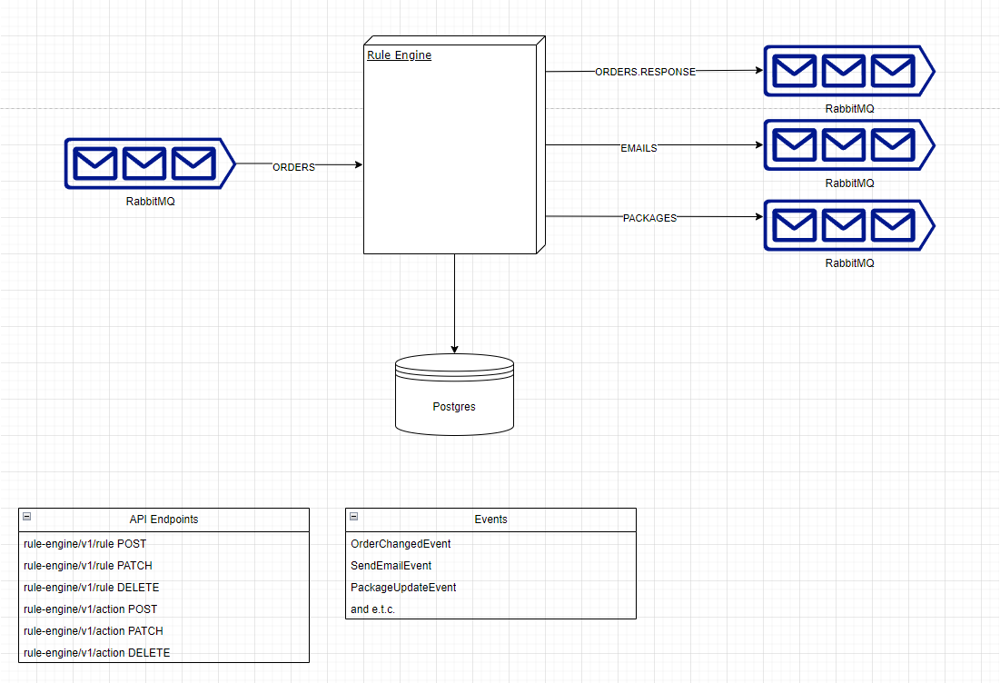

# Kata 16 business rule management

## Source: http://codekata.com/kata/kata16-business-rules/

### Introduction
This particular Kata states a problem of business rule management, let's admit in real world managing such rules is a
really big headache. Couple of reasons:

* Rules might be changed frequently
* Rules can be and should be removed and added dynamically, otherwise developer should be involved in each change,
and it would be really time-consuming for developers to implement code changes for each rules
* Rules should be somehow prioritized
* Rules might be contradictory

This is only small part of reasons why this problem might be really important for software engineers to solve, now 
let's jump in and address this problem.
### Thoughts
    
Probably the most powerfull tool that software engineer has in his hands is abstraction, as I mentioned previously 
managing those rules is a really hard part itself, so let's not overcomplicate the things and don't think about the details
like how email will be sent, which service will update order status and in general order changes, instead let's use the tool
that we have in our hands and only think about how we will manage rules. I think the best approach to solve this problem 
is to understand that this particular logic should be a standalone 'microservice', of course you might think that this 
small logic might not be a good candidate for a standalone 'microservice', but let's give it a second thought.

Pros:
* Change management of service, application can be independently changed and deployed
* As it was discussed in kata, frequent changes are expected to this service,
so in this case I would isolate this artifact to avoid cascading failures
* Independently scalable service that can be scaled according to the needs
* Shared nothing architecture, this service would be fully responsible for managing the rules and applying them

 Cons:
* Latency of the order placement, before placing the order rules should be applied to define the final state of order
* Every change should be controlled in runtime that makes harder and forces us to use strategies like canary deployment 
for change management
* Having both asynchronous and synchronous communication in one application isn't great, from the deployment strategy and scaling perspective
* Additional monitoring maintenance tasks for engineers

So to sum up, I see more benefits to treat this problem as isolated component of the system which can be independently 
deployable and scalable, It gives engineers more control over the application and makes business requirements easier to implement.

As for non-functional requirements we already explained the possibility of scaling the application, we will also implement
Security features for the application, but it will be simple without any authorization servers.

### Architecture/Implementation

Let's also quickly talk about the architecture

As mentioned we will use abstraction to not worry about the email sending, order updates and e.t.c. Instead, we will concentrate
on rule management, so what we see on the image is a single service which is responsible for managing and applying the rules to the orders.
Application will listen for coming events from ORDERS queue which will contain the full snapshot of order rule engine will operate
on particular order and will decide what rules should be applied and what actions should be taken, as a result rule-engine will dispatch
different events to different queues to the services which are responsible for performing this action. Application will also have the API  endpoints
for managing the rules inside the rule-engine.

To sum up, rule-engine application purely worries about the rule management, it is not responsible for performing actions
instead it acts as an orchestrator and depending on the rules matched will dispatch different events to the services that
actually will perform actions.